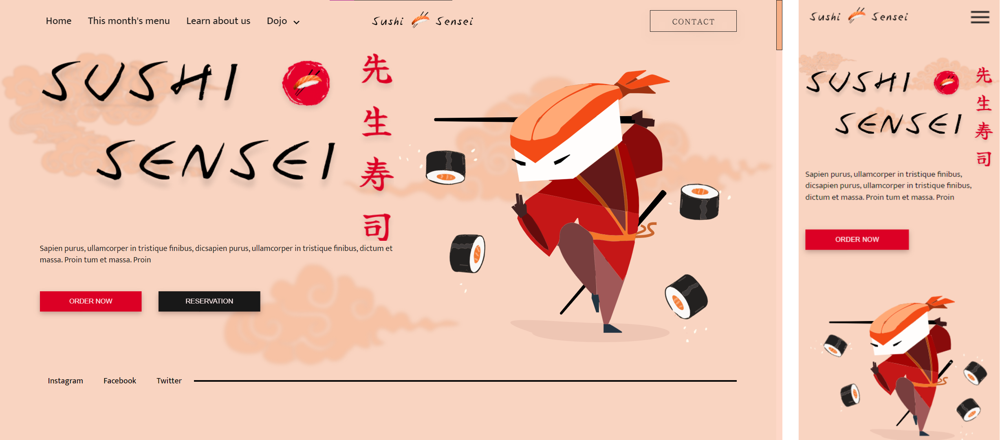

<h1 align="center">
    Sushi Sensei 
</h1>

  

  <a href="#-tecnologias">Tecnologias</a>&nbsp;&nbsp;&nbsp;|&nbsp;&nbsp;&nbsp;
  <a href="#-projeto">Projeto</a>&nbsp;&nbsp;&nbsp;|&nbsp;&nbsp;&nbsp;
  <a href="#memo-licença">Licença</a>

 
  

  

 

  

## 🏮 Tecnologias

Esse projeto foi desenvolvido com as seguintes tecnologias:

- HTML
- CSS / SASS
- JavaScript

## 🚧 Projeto

Live Preview: https://llucasbruno.github.io/SushiSensei/

## :memo: Licença

Esse projeto está sob a licença MIT. Veja o arquivo [LICENSE](LICENSE) para mais detalhes.

---

Feito com ♥ by llucasbruno
